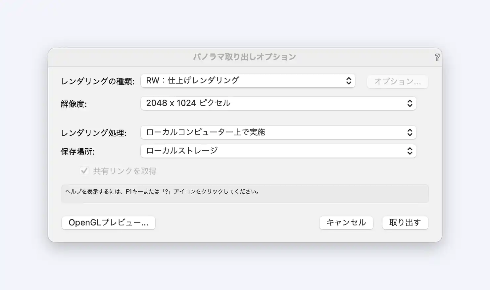

### 1. CSSのリセット

   まずHTMLファイルの`<head></head>`タグの中に

   ```html
   <link rel="stylesheet" href="https://cdn.rawgit.com/filipelinhares/ress/master/dist/ress.min.css">
   ```

   をコピー&ペーストしてCSSをリセット(いらないpaddingやmarginを消す)します。

### 2. aframeの読み込み

   次は[aframe](https://aframe.io/)(WEBで3Dを簡単に使えるようにする)を読み込みます。

   ```html
   <script src="https://cdnjs.cloudflare.com/ajax/libs/aframe/1.0.4/aframe.min.js"></script>
   ```

   上のコードをHTMLファイルの`<head></head>`タグの中にコピー&ペーストします。

   ```html
   <!DOCTYPE html>
   <html lang="ja">
   
   <head>
       <meta charset="UTF-8">
       <meta name="viewport" content="width=device-width, initial-scale=1.0">
       <!-- リセットCSS -->
       <link rel="stylesheet" href="https://cdn.rawgit.com/filipelinhares/ress/master/dist/ress.min.css">
       <!-- Aframe -->
       <script src="https://cdnjs.cloudflare.com/ajax/libs/aframe/1.0.4/aframe.min.js"></script>
       <title>好きなタイトル</title>
   </head>
   
   <body>
   
   </body>
   
   </html>
   ```

   こんな感じ

### 3. a-sceneの作成

```html
<a-scene vr-mode-ui="enabled: false" device-orientation-permission-ui="enabled: false">
    <a-assets>
        
    </a-assets>

    <a-sky id="image-360" radius="10" src="#sea"></a-sky>

    <a-entity camera="active: true" look-controls position="0 0 0">
    </a-entity>
</a-scene>
```

上記のコードをbodyの中に書く

```html

```

の`src="./test-image.jpg"`の部分で画像のリンクを指定すれば完成。


## VectorWorksからパノラマ写真を取り出す方法

[vectorworks公式サイト](https://bim.aanda.co.jp/blog/2019/08/4781/)に乗ってた。

設定は↓がおすすめ



